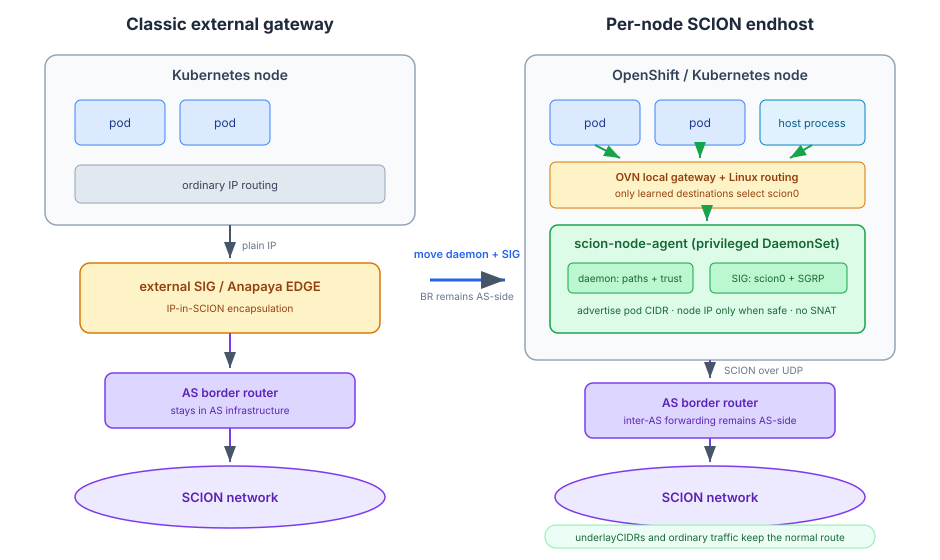
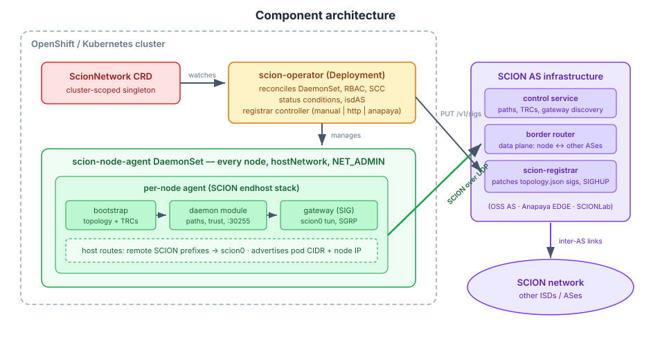
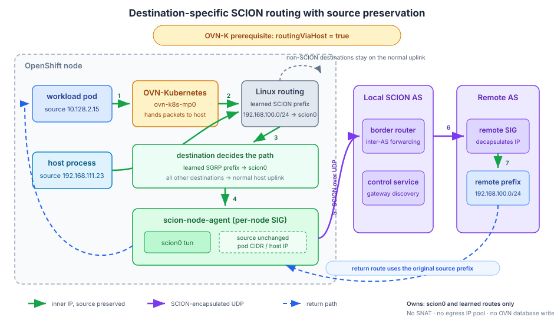

<p align="center">
  
</p>

scion-k8s-operator makes every node of an OpenShift/Kubernetes cluster a
first-class [SCION](https://scion.org) endhost, designed to terminate
IP-in-SCION tunneling directly on the node and expose transparent,
bidirectional SCION connectivity to unmodified workloads.

**This project is in the early stage of development. Use carefully!**

## Enable transparent IP-over-SCION in your cluster

scion-k8s-operator gives any workload — pods and host processes alike —
connectivity to remote SCION networks with zero application changes. Egress
to remote SCION prefixes is steered through a per-node tun device. Inbound
traffic reaches pod CIDRs advertised by each node and, where safe and enabled,
explicitly advertised node IPs.

Behaving as a per-node SCION-IP gateway, the integration is seamless,
exactly as if a physical SCION gateway appliance was moved inside the node.

## Enable SCION-native applications

Every node also exposes the standard SCION daemon API on
`127.0.0.1:30255`, so path-aware applications (snet, PAN, scion-sdk) get
native SCION sockets out of the box — no sidecars, no extra daemons.

## Overview

Where we normally have cluster nodes sending plain IP toward an external
SCION gateway appliance (a SIG or Anapaya EDGE), which tunnels it into the
SCION network, scion-k8s-operator runs the whole SCION **endhost** stack —
bootstrap, daemon, and SCION-IP gateway — directly on every node.

Only the endhost side moves into the node. The **AS border router** — the
data-plane component that forwards SCION packets between ASes — stays in the
AS infrastructure, together with the control service: every SCION packet a
node sends or receives travels as plain UDP between the node and its local
border router, which handles all inter-AS forwarding. Nodes are SCION
endhosts, not routers.

After the operator is deployed and a `ScionNetwork` is configured, each node
bootstraps against the local SCION AS, brings up a `scion0` tun device, and
exchanges prefixes with remote gateways. Linux routes learned through SGRP
select SCION destinations; ordinary and node-to-AS underlay traffic keeps its
normal route.



The operator watches a single cluster-scoped `ScionNetwork` resource,
manages the per-node agent DaemonSet, and — through a pluggable registrar —
keeps the AS-side gateway registration in sync as nodes come and go:



### OVN-Kubernetes pod-egress path

OVN-Kubernetes shared-gateway mode bypasses host routes. Transparent pod
egress therefore requires `routingViaHost: true`, and preserving pod source
addresses requires OVN route advertisements for the default pod network.
After OVN hands a packet to the host, only a route learned through SGRP can
select `scion0`; all other destinations retain their normal route. Configure
`acceptPolicy.underlayCIDRs` for every node-to-AS transport network so SCION
control, discovery, and registrar traffic cannot recursively enter the tunnel.
The agent does not perform SNAT and does not modify `br-ex` or the OVN database.



This source-preserving path passed the hardened live OpenShift e2e suite on
2026-08-20. See the [implementation plan](docs/superpowers/plans/2026-08-20-ovn-local-gateway-egress.md).

## Quick start

```bash
oc apply -k config/manifests
oc apply -f config/samples/scion_v1alpha1_scionnetwork.yaml   # edit first
```

```yaml
apiVersion: scion.mkowalski.github.io/v1alpha1
kind: ScionNetwork
metadata:
  name: cluster
spec:
  bootstrap:
    mode: url
    discoveryURL: http://scion-ds.example.org:8041
  acceptPolicy:
    isdASes:
      - 1-ff00:0:110
    underlayCIDRs:
      - 192.168.111.0/24  # node-to-AS transport; edit for your network
```

Requirements: a SCION AS (open-source control service + border router,
Anapaya EDGE, or a [SCIONLab](https://www.scionlab.org) user AS) reachable
from the nodes; UDP 30056/30256/30856 open between nodes and the AS
infrastructure; every node-to-AS transport network listed in
`acceptPolicy.underlayCIDRs`; and the node SIGs registered AS-side,
automatically via the bundled registrar or manually
([docs/as-registration.md](docs/as-registration.md)). OpenShift OVN-K also
requires the two settings described above.

## Check the documentation

- [docs/install.md](docs/install.md) — full installation walkthrough, every
  `ScionNetwork` field, OLM bundle path
- [docs/as-registration.md](docs/as-registration.md) — AS-side gateway
  registration (manual, registrar service, Anapaya)
- [docs/research.md](docs/research.md) — SCION/Anapaya/OpenShift research
  behind the design
- [docs/decisions.md](docs/decisions.md) — decision log
- [docs/known-gaps.md](docs/known-gaps.md) — honest list of what is not yet
  verified or implemented
- [docs/handoff.md](docs/handoff.md) — full project state snapshot (repos,
  branches, live environment, next steps) for picking the work up cold

## Development

Make targets: `build`, `test`, `lint`, `manifests` (regenerate CRD),
`images` (`IMG_REGISTRY`/`VERSION` knobs), `bundle` / `bundle-check` (OLM),
`envtest`. A local multi-AS SCION dev topology plus a discovery server lives
in [hack/dev-scion-topology](hack/dev-scion-topology/README.md); integration
tests in [test/integration](test/integration), OpenShift end-to-end in
[test/e2e](test/e2e/README.md).

## License

Copyright 2026.

Licensed under the Apache License, Version 2.0 (the "License");
you may not use this file except in compliance with the License.
You may obtain a copy of the License at

    http://www.apache.org/licenses/LICENSE-2.0

Unless required by applicable law or agreed to in writing, software
distributed under the License is distributed on an "AS IS" BASIS,
WITHOUT WARRANTIES OR CONDITIONS OF ANY KIND, either express or implied.
See the License for the specific language governing permissions and
limitations under the License.
